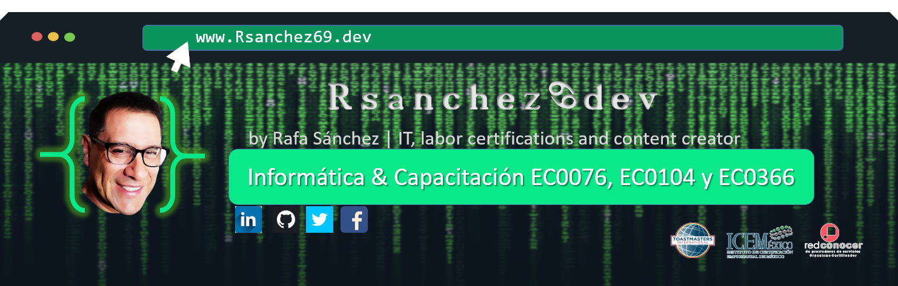

<!DOCTYPE html>
<html>
<!--ENCABEZADO-->
<head>
    <meta charset="UTF-8" />
    <meta http-equiv="X-UA-Compatible" content="IE=edge">
    <meta name="viewport" content="width=, initial-scale=1.0">
<!--TITULO DE LA WEB-->
    <!--<title>RsanchezDev3</title>-->
    <link rel="stylesheet" href="style.css">
    <link href="https://fonts.googleapis.com/css2?family=Roboto&display=swap" rel="stylesheet">
</head>
<!--CUERPO-->
    <body>
<!--IMAGEN DEL LOGO Y 1ERA FRASE-->
        <h1 class="heading-element" dir="auto"> Hola, soy Rafa Sánchez👍🏼
        </h1>
        <h2 class="subtitulo">Informática & Capacitación laboral EC0076, EC0104, EC366.</h2>
<!--IMAGEN CENTRAL-->
=======
                href="./Img/Img04 Logo.png"></a> Hola, soy Rafa Sánchez👍🏼
        </h1>
        <h2 class="subtitulo">Informática & Capacitación laboral EC0076, EC0104, EC366.</h2>
>>>>>>> 0b78bcdec35a5f6140223cdb4f2c801c0418813c
        
<!--PARRAFO DE LA BIOGRAFÍA PERSONAL-->
         
        
Soy Informático Administrativo, actualmente curso mi 2da. carrera Ing. Gestion de Tecnologías de la Información.

        
He fundado diversas startup y proyectos educativos, y actualmente me dedico a capacitar a profesionales y 
            emprendedores a través de cursos y certificaciones laborales de alta calidad. Mis cursos te permitirán adquirir las habilidades
        necesarias para destacar en el mercado laboral y trabajar de forma remota.

        
¡Impulsa tu carrera con certificaciones de calidad!"

        <h2 class="subtitulo">Algunos proyectos</h2>
        <ul>
            <li>Proyecto NIPyi (actual)</li>
                
Startup de servicio de Capacitación y Certificaciones de habilidades laborales con reconocimiento oficial

            <li>Proyecto MSD-Soft (2009)</li>
                
 Startup de servicio de capacitación para "Desarroladores Web en trabajo remoto"

            <li>Proyecto NIPgi (2008)</li>
                
 Startup de servicio de capacitación en Teletrabajo

            <li>Proyecto R@itnet (2001)</li>
                
Startup de servicio de HW y SW

            </li>
        </ul>
        <h2 class="subtitulo">Para contacto directo y apoyo</h2>
        <ul>
            <li> My Publicin Box</li>
            <li> E-mail Personal</li>
            <li> Buy Me a Coffee</li>
        </ul>
<!--PIE DE PAGINA-->
        <footer>
            </h2 Sigueme en mis redes sociales</h2>
            <ul>
                <li>Facebook Rsanchez69</li>
                <li>LinkeId  Rsanchez69</li>
                <li>X-Twitter @Rsanchez2</li>
            </ul>
        </footer>
    </body>
</html>
